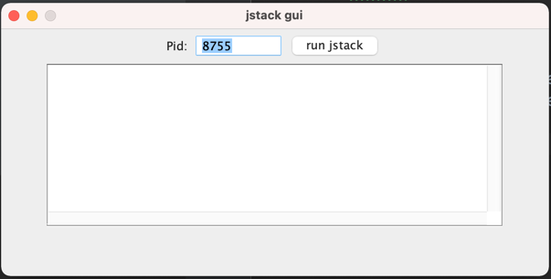

# jstack-gui

jstack-gui, a launcher of jstack without console.

this project includes:

1. run jstack from gui
2. launch jstack-gui for minecraft as a mod

## How to use

1. install jdk and restart your pc.
2. enter pid to text field. if you use this as a mod, 
   you don't need to do this step.
3. click "run jstack"
4. now jstack result is on textarea

